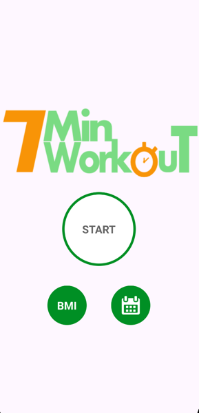
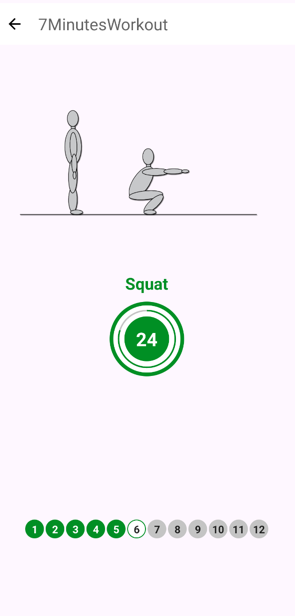
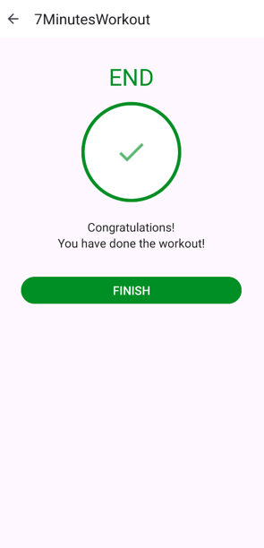
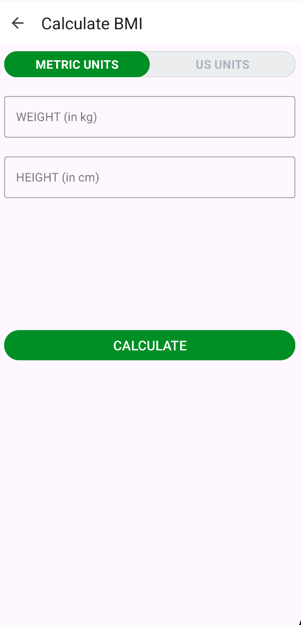
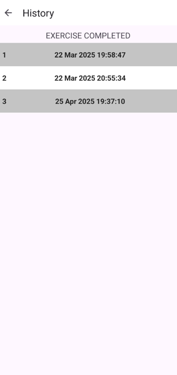

# 7MinutesWorkout

### Android workout app that lets you take a 12-exercise workout, calculate your BMI, and view your workout history

## Used technologies and tools

- Kotlin
- Android SDK
- Android XML
- Room database
- RecyclerView
- View binding
- TextToSpeech

## Illustrations

### Start screen

### Exercise screen

### Finish screen

### BMI calculation

### History screen

